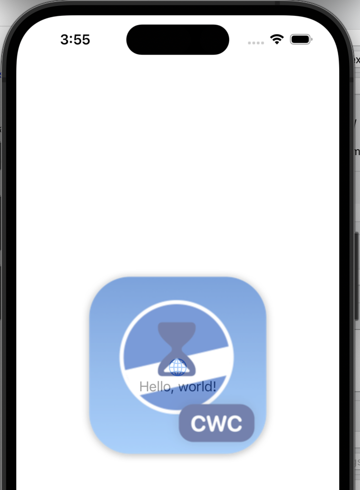
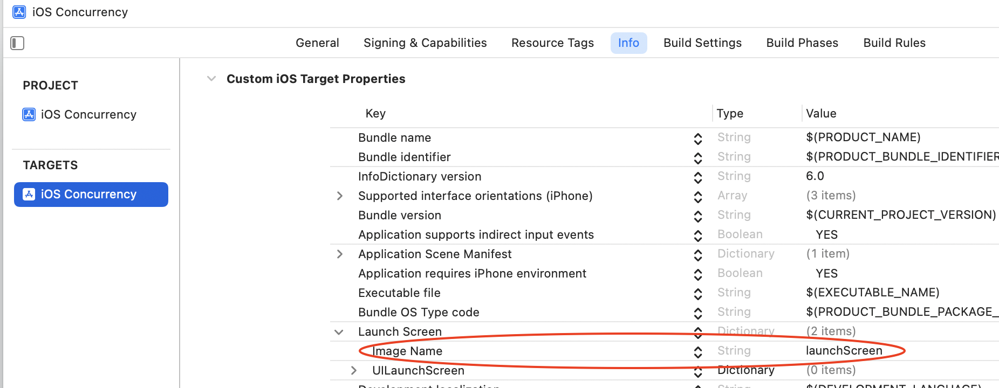

#  iOS Concurrency
Notes from the iOS Concurrency lessons by Stewart Lynch from CodeWithChris.com:
 https://learn.codewithchris.com/courses/take/swift-concurrency/lessons/30957497-01-creating-models-and-apiservice

# Custom App Loading/ Launch Screen
In iOS 15, you can add a custom image to display as your app launches. To do this go to the info pane under the
 project. This replaced the info.plist from
previous versions of Xcode/ iOS. Within the info pane, create a new key named `Image Name` with a value of the image you want
to display listed in the Assets folder:

Here is where you set the custom launch screen:

# Reusable Request Calls
You can re-use the `APIService.swift` file for any type of API, which returns JSON data. 

# Custom App Icon
You can replace the `AppIcon.appiconset`, which displays the app icon on the home screen with your app.

# Model Shortcuts
You can quickly use a tool like https://app.quicktype.io to generate a Swift model based on JSON. Meanwhile, a site like 
this provides us with a free API endpoint: https://jsonplaceholder.typicode.com.

 
