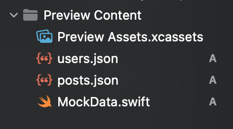

#  iOS Concurrency
Notes from the iOS Concurrency lessons by Stewart Lynch from CodeWithChris.com:
 https://learn.codewithchris.com/courses/take/swift-concurrency/lessons/30957497-01-creating-models-and-apiservice

# Custom App Loading/ Launch Screen
In iOS 15, you can add a custom image to display as your app launches. To do this go to the info pane under the
 project. This replaced the info.plist from
previous versions of Xcode/ iOS. Within the info pane, create a new key named `Image Name` with a value of the image you want
to display listed in the Assets folder:


Here is where you set the custom launch screen:


# Reusable Request Calls
You can re-use the `APIService.swift` file for any type of API, which returns JSON data. 

# Custom App Icon
You can replace the `AppIcon.appiconset`, which displays the app icon on the home screen with your app.

# Model Shortcuts
You can quickly use a tool like https://app.quicktype.io to generate a Swift model based on JSON. Meanwhile, a site like 
this provides us with a free API endpoint: https://jsonplaceholder.typicode.com.

# Mock Data 
We can generate mock data to be used within our Views.
1) Create a new JSON file containing the mock data, which conforms to the Decodeable object like Users or Posts in the Preview Content folder.
    
1) Create a new Extensions group to hold an extension for the Bundle, which will allow us to easily decode the JSON. Grab the file here: 
 https://gist.githubusercontent.com/StewartLynch/a84b4ddbeaf5a78e94bfe604ff7c7d7d/raw/321848e3980b3557423d44176a27bc9d167cf0fa/Bundle+Extension
    [Extensions folder](img/extensionsFolder.png)
1) Create a `MockData.swift` file to extend the structs with mock data from the JSON files:
```
/// Creates mock data for the User class for our views
extension User {
    // Create a computed property, which returns a list of users from the users.json file
    static var mockUsers: [User] {
        Bundle.main.decode([User].self, from: "users.json")
    }
    
    // Return a single user, or the first one in the mockUsers list
    static var mockSingleUser: User {
        Self.mockUsers[0]
    }
}
```
1) In your ViewModel, extend it so that it uses a convenience initializer on whether/ not to show the mock data:
```
/// Only use this in the preview
extension UsersListViewModel {
    convenience init(forPreview: Bool = false) {
        // Initialize the regular class
        self.init()
        
        // If preview is active, then set the users property equal to the mock users
        if forPreview {
            self.users = User.mockUsers
        }
    }
}
```
1) Tell your View whether/ not to display the Preview:
```
#warning("Remove preview below prior to shipping or set to false")
@StateObject var vm = UsersListViewModel(forPreview: true)
```
