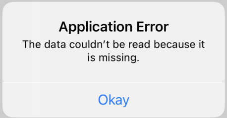

#  iOS Concurrency
Notes from the iOS Concurrency lessons by Stewart Lynch from CodeWithChris.com:
 https://learn.codewithchris.com/courses/take/swift-concurrency/lessons/30957497-01-creating-models-and-apiservice

# Custom App Loading/ Launch Screen
In iOS 15, you can add a custom image to display as your app launches. To do this go to the info pane under the
 project. This replaced the info.plist from
previous versions of Xcode/ iOS. Within the info pane, create a new key named `Image Name` with a value of the image you want
to display listed in the Assets folder:


Here is where you set the custom launch screen:


# Reusable Request Calls
You can re-use the `APIService.swift` file for any type of API, which returns JSON data. 

# Custom App Icon
You can replace the `AppIcon.appiconset`, which displays the app icon on the home screen with your app.

# Model Shortcuts
You can quickly use a tool like https://app.quicktype.io to generate a Swift model based on JSON. Meanwhile, a site like 
this provides us with a free API endpoint: https://jsonplaceholder.typicode.com.

# Mock Data 
We can generate mock data to be used within our Views.
1) Create a new JSON file containing the mock data, which conforms to the Decodeable object like Users or Posts in the Preview Content folder.
    
1) Create a new Extensions group to hold an extension for the Bundle, which will allow us to easily decode the JSON. Grab the file here: 
 https://gist.githubusercontent.com/StewartLynch/a84b4ddbeaf5a78e94bfe604ff7c7d7d/raw/321848e3980b3557423d44176a27bc9d167cf0fa/Bundle+Extension
    [Extensions folder](img/extensionsFolder.png)
1) Create a `MockData.swift` file to extend the structs with mock data from the JSON files:
```
/// Creates mock data for the User class for our views
extension User {
    // Create a computed property, which returns a list of users from the users.json file
    static var mockUsers: [User] {
        Bundle.main.decode([User].self, from: "users.json")
    }
    
    // Return a single user, or the first one in the mockUsers list
    static var mockSingleUser: User {
        Self.mockUsers[0]
    }
}
```
1) In your ViewModel, extend it so that it uses a convenience initializer on whether/ not to show the mock data:
```
/// Only use this in the preview
extension UsersListViewModel {
    convenience init(forPreview: Bool = false) {
        // Initialize the regular class
        self.init()
        
        // If preview is active, then set the users property equal to the mock users
        if forPreview {
            self.users = User.mockUsers
        }
    }
}
```
1) Tell your View whether/ not to display the Preview:
```
#warning("Remove preview below prior to shipping or set to false")
@StateObject var vm = UsersListViewModel(forPreview: true)
```

# User Feedback
## Loading Data 
You can implement an @Published property to track whether/ not an asynchronous call has finished loading. Using
this property in the view model allows you to show an alternative screen to users until the data loads.

First, add the published property to the ViewModel:
```
// Represents whether/ not something is loading
@Published var isLoading = false
```
Next, set the loading property to true as you begin to fetch the data from the API. Also, use a defer call, which
will execute once the function closes. 
```
func fetchUsers() {
    // Setup the APIService
    let apiService = APIService(urlString: "https://jsonplaceholder.typicode.com/users")
    
    // Toggle when loading
    isLoading.toggle()
...
// Call the API here
apiService.getJSON { (result: Result<[User], APIError>) in // Tell it to return a Result of list of users and APIError for the error
    // Executes this code, once it has retrieved/ processed the data
    defer {
        // Turn the toggle to isLoading to false
        DispatchQueue.main.async {
            self.isLoading.toggle()
        }
    }
```
Meanwhile, in your View use an `.overlay` modifier to tell it to display the pre-built loading `ProgressView`
prior to it fully loading:
```
.overlay(content: {
    // Check if the screen is loading
    if vm.isLoading {
        // If it is, then display this
        ProgressView("Loading users")
    }
})
```

Note, you can use the following code block to simulate that it takes an additional one second to load
data:
```
DispatchQueue.main.asyncAfter(deadline: .now() + 1) {
    <APICall goes here>
}
```

## Error Handling

You can use a property to measure whether/ not an error has occurred, and even display this error to the 
user. 
```
// Determines whether/ not to show an error alert to the user
@Published var showAlert = false
// Variable that holds error message
@Published var errorMessage: String?
```
Then setup a case statement to handle any errors, and update the error message for the user:
```
// Use a switch statement to handle the types of responses
switch result {
case .success(let users):
    // Re-enter the main thread to update the Published users in the view
    DispatchQueue.main.async {
        self.users = users
    }
    // If the result object is a failure, then do this
case .failure(let error):
    // Update with custom error message
    DispatchQueue.main.async {
        self.showAlert = true
        self.errorMessage = error.localizedDescription + "\n Please contact the developer with this error, and the steps to reproduce it."
    }
}
```
Meanwhile, in your view, you can key off on whether/ the boolean to show an error is true/ false. Then use that binding
to display an alert:
```
.alert("Application Error", isPresented: $vm.showAlert, actions: {
    // Let's user press okay button to 
    Button("Okay") {}
}, message: {
    // Only show error message if not nil
    if let errorMessage = vm.errorMessage {
        Text(errorMessage)
    }
})
```
